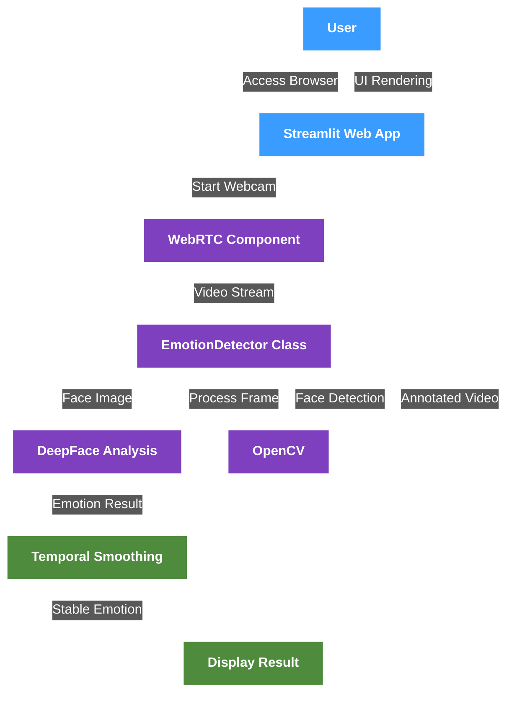
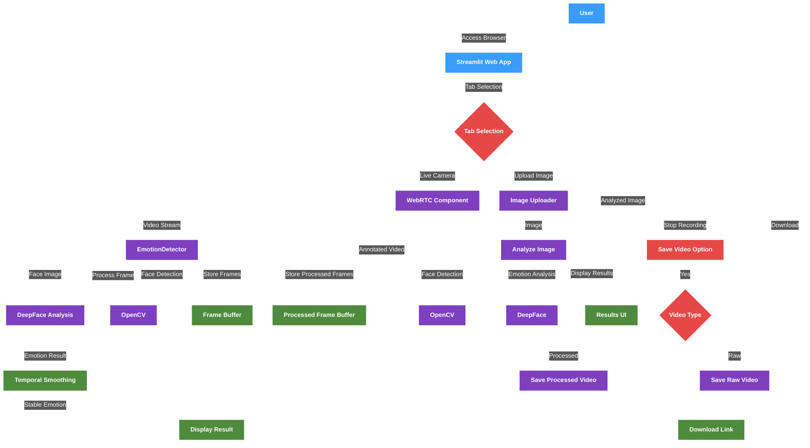
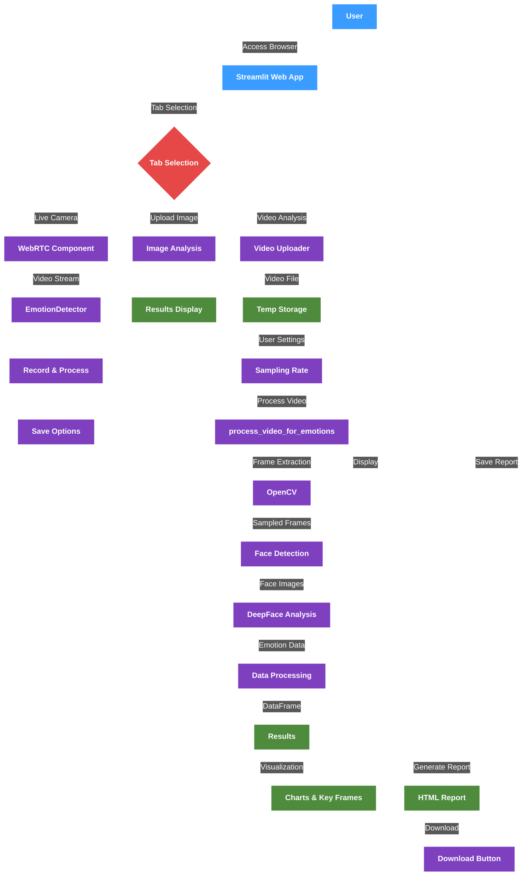
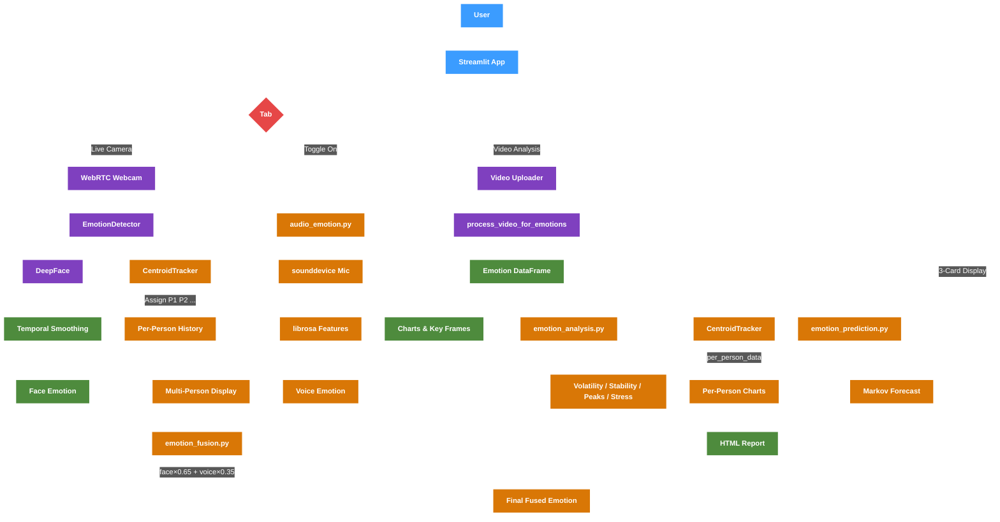
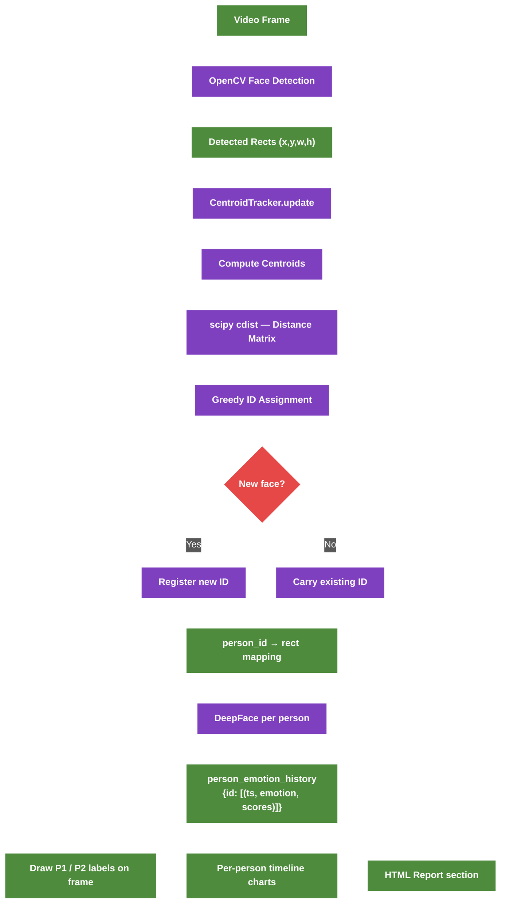
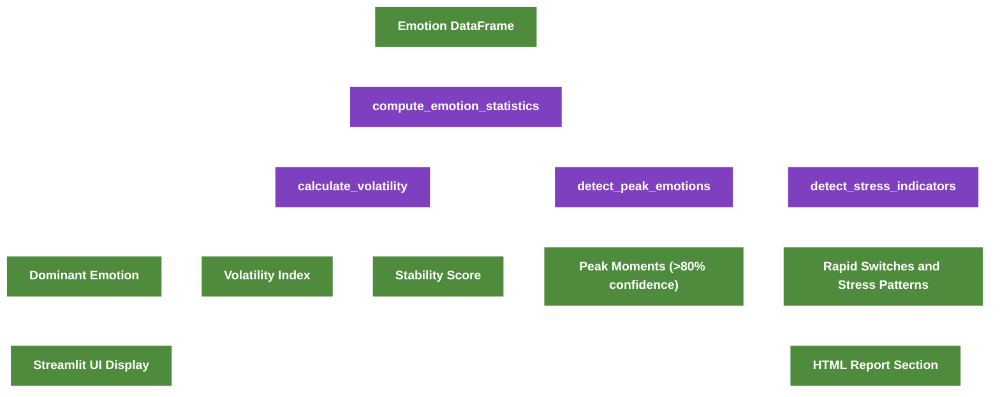
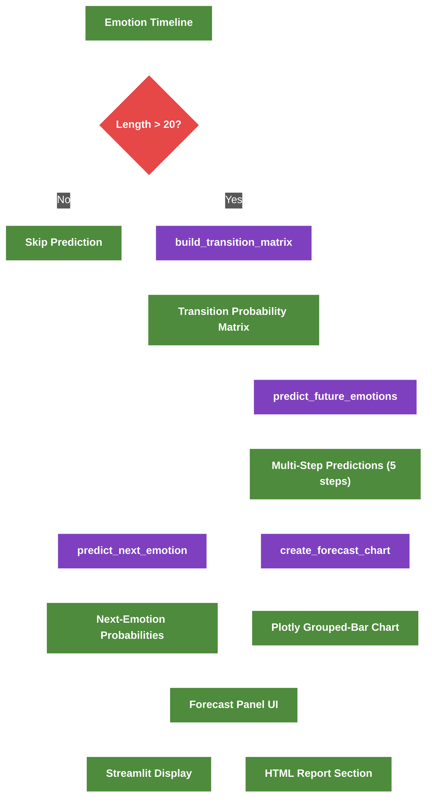
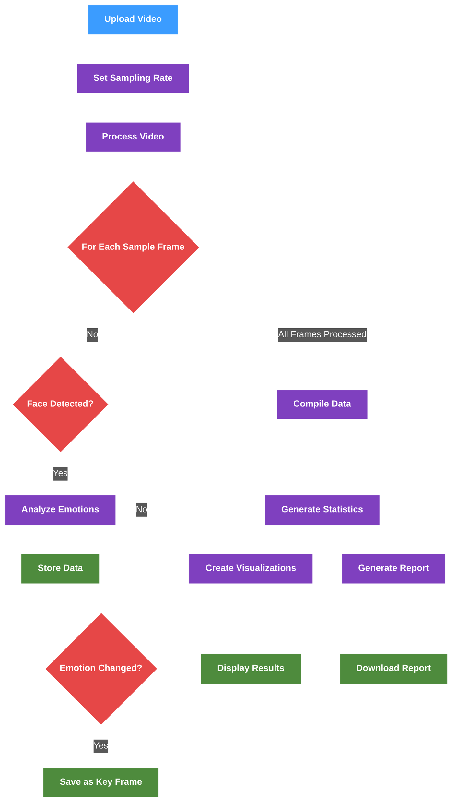

# Emotion AI

A real-time emotion detection application that analyzes facial expressions using webcam feed, image uploads, and video analysis.

## 👨‍💻 Project Information

### Project Type
**Copyright Project**

### Team Members

| Name | Roll Number |
|---|---|
| Sanpreet Singh | 2210990790 |
| Sanidhya Chauhan | 2210990786 |
| Sai Madhav Bhalla | 2210990760 |
| Sambhav Yadav | 2210990774 |

---

## 📚 Table of Contents

- [Emotion AI](#emotion-ai)
  - [📚 Table of Contents](#-table-of-contents)
  - [🚀 Features](#-features)
    - [Version 1 (app.py)](#version-1-apppy)
    - [Version 2 (appv2.py)](#version-2-appv2py)
    - [Version 3 (appv3.py)](#version-3-appv3py)
    - [Version 4 (appv4.py) — Latest](#version-4-appv4py--latest)
  - [🗂️ Project Structure](#️-project-structure)
  - [🔧 Installation](#-installation)
    - [Prerequisites](#prerequisites)
    - [Setup](#setup)
  - [💻 Usage](#-usage)
  - [🔬 Technologies](#-technologies)
  - [📊 Architecture Diagrams](#-architecture-diagrams)
  - [📜 License](#-license)

## 🚀 Features

### Version 1 (app.py)

The initial version provides real-time emotion detection through webcam:

- **Live Webcam Analysis**: Detects and analyzes emotions in real-time
- **Temporal Smoothing**: Reduces rapid emotion switching with a history buffer
- **Confidence Display**: Shows confidence percentage for detected emotions
- **Modern UI**: Dark-themed gradient interface with responsive design
- **Emotion Visualization**: Labels faces with detected emotions and confidence scores

### Version 2 (appv2.py)

Building on version 1, adds:

- **Tabbed Interface**: Separates Live Camera and Image Upload functionality
- **Image Upload Analysis**: Upload and analyze images for emotion detection
- **Video Recording**: Records the webcam feed for later use
- **Video Saving Options**: Save processed videos (with emotion labels) or raw videos
- **Download Functionality**: Download recorded videos in MP4 format
- **Error Handling**: Improved error management and user feedback
- **Test Video Generation**: Create test videos for debugging purposes

### Version 3 (appv3.py)

The most advanced version with comprehensive features:

- **Video Analysis Tab**: Upload and analyze videos for emotion detection
- **Sampling Rate Control**: Adjust the frame sampling rate for video analysis
- **Emotion Timeline**: Visual representation of emotions over time
- **Emotion Distribution**: Pie chart showing the proportion of different emotions
- **Key Emotional Moments**: Captures and displays significant emotional changes
- **Detailed Reports**: Generate and download HTML reports with visualizations
- **Summary Statistics**: Duration, frames analyzed, and dominant emotions
- **Interactive Charts**: Colorful, responsive charts powered by Plotly
- **Improved Styling**: Enhanced report design with responsive layout

### Version 4 (appv4.py) — Latest

Extends v3 with **multimodal emotion detection**, **behavioral analysis**, **multi-person face tracking**, and **emotion prediction**:

#### 🎙️ Voice Emotion Detection (`audio_emotion.py`)
- Toggleable microphone input in the Live Camera tab
- Records 3-second audio clips on demand via the **🎤 Capture Voice Emotion** button
- Extracts acoustic features using `librosa`:
  - **MFCCs** (13 coefficients) — timbral texture
  - **Pitch** (mean & variance via `pyin`) — fundamental frequency
  - **RMS Energy** — loudness
  - **Spectral Contrast** — harmonic structure
  - **Zero Crossing Rate** — voiced/unvoiced signal
- Heuristic classifier maps features to 6 emotions: `happy`, `sad`, `angry`, `fear`, `neutral`, `surprise`

#### 🤝 Multimodal Emotion Fusion (`emotion_fusion.py`)
- Combines face and voice detections via **weighted averaging**:
  ```
  Final = Face × 0.65 + Voice × 0.35
  ```
- Maps DeepFace's 7-class output (including "disgust") onto the shared 6-class set
- Falls back gracefully when one modality is unavailable
- **Three-card display** in the Live Camera tab: Face Emotion | Voice Emotion | Final Emotion

#### 🧠 Behavioral Analysis (`emotion_analysis.py`)
- **Volatility Index**: Emotion switch rate — how often the dominant emotion changes
- **Stability Score**: `1 - volatility` — higher means calmer
- **Peak Emotion Detection**: Identifies moments where confidence exceeds 80%
- **Stress Indicator Detection**: Flags rapid-switching and known stress patterns (e.g. angry → fear → sad)
- **Behavioral Summary**: Human-readable text report of all metrics
- **Two new Plotly charts** in the Video Analysis tab and HTML report:
  - Rolling emotion volatility over time
  - Emotion confidence timeline with peak moment markers

#### 👥 Multi-Person Face Tracking (`face_tracker.py`)
- Assigns **persistent IDs** to detected faces across frames using centroid-based matching
- Uses `scipy.spatial.distance.cdist` for efficient O(n²) Hungarian-style assignment
- Configurable `max_disappeared` threshold (default: 15 frames) before an ID is dropped
- **Live Camera tab**: each face is labeled `P1: Happy (85%)`, `P2: Neutral (72%)`, etc.
  - 👥 Multi-Person Tracking expander shows per-person emotion flow in real time
- **Video Analysis tab**: new 👥 Multi-Person Analysis section with:
  - Per-person emotion timeline charts (interactive Plotly)
  - Dominant emotion & frame count per person
  - Deduplicated emotion sequence (e.g., `Happy → Neutral → Angry`)
- **HTML Report**: 👥 Multi-Person Analysis section with per-person cards, charts, and emotion distribution badges
- Maintains `person_emotion_history` dictionary: `{person_id: [(timestamp, emotion, scores), ...]}`

#### 🔮 Emotion Prediction (`emotion_prediction.py`)
- **Markov Chain Model**: Builds a first-order transition-probability matrix from observed emotion sequences
- `build_transition_matrix(sequence)` — counts consecutive emotion pairs and row-normalises
- `predict_next_emotion(current, matrix)` — returns `{emotion: probability}` sorted by confidence
- `predict_future_emotions(sequence, steps=5)` — multi-step iterative forecast
- `create_forecast_chart(predictions)` — Plotly grouped-bar visualisation of future probabilities
- **Activation threshold**: Prediction only runs when the emotion timeline exceeds **20 frames**
- **Live Camera tab**: "🔮 Emotion Forecast" panel with predicted next emotion, confidence %, and top-5 probability bars
- **Video Analysis tab**: Forecast metrics (predicted emotion, confidence, runner-up), expandable probability breakdown, and multi-step forecast chart
- **HTML Report**: "🔮 Emotion Prediction Analysis" section with stat cards and embedded Plotly chart

---

## 🗂️ Project Structure

```
emotion-python/
├── app.py                # Version 1 — live webcam detection
├── appv2.py              # Version 2 — + image upload & recording
├── appv3.py              # Version 3 — + video analysis & reports
├── appv4.py              # Version 4 — + voice, behavioral, tracking & prediction (← current)
│
├── audio_emotion.py      # Voice recording & emotion prediction via librosa
├── emotion_fusion.py     # Weighted face + voice emotion fusion
├── emotion_analysis.py   # Behavioral metrics, volatility, stress detection
├── face_tracker.py       # Centroid-based multi-person face tracker
├── emotion_prediction.py # Markov chain emotion forecasting
│
├── requirements.txt      # Pinned dependency list
└── README.md
```

---

## 🔧 Installation

### Prerequisites

- Python 3.11
- UV package manager

### Setup

1. **Install UV Package Manager**:

   For Windows:

   ```powershell
   powershell -ExecutionPolicy ByPass -c "irm https://astral.sh/uv/install.ps1 | iex"
   ```

   For macOS/Linux:

   ```bash
   curl -LsSf https://astral.sh/uv/install.sh | sh
   ```

2. **Create and Activate Virtual Environment**:

   For Windows:

   ```powershell
   uv venv myenv --python=3.11
   myenv\Scripts\activate
   ```

   For macOS/Linux:

   ```bash
   uv venv myenv --python=3.11
   source myenv/bin/activate
   ```

3. **Install Core Dependencies**:
   ```
   uv pip install streamlit opencv-python-headless streamlit-webrtc deepface
   uv pip install numpy==1.26.3
   uv pip install matplotlib plotly pandas
   ```

4. **Install v4 Additional Dependencies** (for voice + behavioral analysis):
   ```
   uv pip install librosa sounddevice scikit-learn tf-keras
   ```

## 💻 Usage

Run any version of the application using Streamlit:

```
streamlit run app.py      # For version 1
streamlit run appv2.py    # For version 2
streamlit run appv3.py    # For version 3
streamlit run appv4.py    # For version 4 (recommended)
```

### Version 1: Live Webcam Emotion Detection

- Grant camera access when prompted
- Position your face in the frame
- Ensure good lighting for better detection
- See real-time emotion analysis with confidence scores

### Version 2: Webcam + Image Upload Analysis

- **Live Camera Tab**: Same as Version 1, plus video recording
- **Upload Image Tab**: Upload images for emotion analysis
- When stopping the webcam feed, choose to save the video with emotion labels

### Version 3: Complete Emotion Analysis Suite

- **Live Camera Tab**: Same as Version 2
- **Upload Image Tab**: Same as Version 2
- **Video Analysis Tab**: Upload videos for comprehensive emotion analysis
  - Adjust sampling rate for processing speed vs. accuracy
  - View emotion distribution, timeline, and key moments
  - Download detailed HTML reports with interactive visualizations

### Version 4: Multimodal Emotion Analysis Suite

#### Live Camera Tab
- Grant camera access when prompted
- Position your face in the frame with good lighting
- Toggle **🎙️ Enable Voice Emotion Detection** to activate microphone input
- Click **🎤 Capture Voice Emotion (3 s)** while speaking to record a sample
- Three emotion cards appear below the feed: **Face** | **Voice** | **Final (Fused)**

#### Upload Image Tab
- Upload a JPG/PNG image with one or more faces
- AI detects and labels emotions per face with confidence scores

#### Video Analysis Tab
- Upload an MP4/MOV/AVI video and set the sampling rate
- Click **Analyze Video** to process
- View: emotion distribution pie chart, confidence timeline, key moments
- Behavioral Analysis section shows:
  - Stability Score & Volatility Index metrics
  - Rolling volatility chart
  - Peak emotion markers chart
  - Peak emotion moments (timestamps where confidence > 80%)
  - Stress indicators (rapid-switching and stress-pattern detection)
- **🔮 Emotion Forecast** section (when > 20 frames of data):
  - Predicted next emotion with confidence score and runner-up
  - Expandable probability breakdown for all emotions
  - Multi-step forecast chart (grouped-bar visualisation)
- **👥 Multi-Person Analysis** section (when multiple faces are detected):
  - Per-person expanders showing emotion flow and timeline charts
  - Dominant emotion and frame count per tracked individual
- Download a detailed **HTML report** with all charts, behavioral data, prediction analysis, and per-person analysis embedded

---

## 🔬 Technologies

| Library | Purpose |
|---|---|
| **Streamlit** | Web application framework |
| **Streamlit-WebRTC** | Real-time webcam streaming |
| **OpenCV** | Computer vision — face detection, video I/O |
| **DeepFace** | Facial emotion analysis |
| **librosa** | Audio feature extraction (MFCC, pitch, spectral) |
| **sounddevice** | Microphone audio recording |
| **scipy** | Centroid distance matching for multi-person tracking |
| **Plotly** | Interactive charts and visualizations |
| **Matplotlib** | Static chart rendering |
| **NumPy** | Numerical computing |
| **Pandas** | Data analysis and time-series handling |
| **UV** | Fast Python package installer |

## 📊 Architecture Diagrams

### Version 1 (app.py) Architecture



### Version 2 (appv2.py) Architecture



### Version 3 (appv3.py) Architecture



### Version 4 (appv4.py) Architecture



> **Legend** — 🟠 Orange nodes are new in v4.

### Multimodal Fusion Flow

```mermaid
%%{init: { 'theme': 'dark', 'flowchart': { 'curve': 'natural' } } }%%
flowchart LR
    classDef default fill:#2D2B55,stroke:#FFFFFF,stroke-width:2px,color:#FFFFFF,font-weight:bold
    classDef dataNode fill:#4E8B3D,stroke:#FFFFFF,stroke-width:2px,color:#FFFFFF,font-weight:bold
    classDef processNode fill:#7F40BF,stroke:#FFFFFF,stroke-width:2px,color:#FFFFFF,font-weight:bold
    classDef choiceNode fill:#E64747,stroke:#FFFFFF,stroke-width:2px,color:#FFFFFF,font-weight:bold

    A[Webcam Frame] --> B[Face Detection]
    B --> C[DeepFace Analysis]
    C --> D[Temporal Smoothing]
    D --> E["Face Scores (7 classes)"]

    F[Microphone] --> G[sounddevice Record]
    G --> H[librosa Feature Extraction]
    H --> I[Heuristic Classifier]
    I --> J["Voice Scores (6 classes)"]

    E --> K[emotion_fusion.py]
    J --> K
    K -->|"face×0.65 + voice×0.35"| L[Fused Scores]
    L --> M[Final Dominant Emotion]

    A:::dataNode
    B:::processNode
    C:::processNode
    D:::processNode
    E:::dataNode
    F:::dataNode
    G:::processNode
    H:::processNode
    I:::processNode
    J:::dataNode
    K:::processNode
    L:::dataNode
    M:::dataNode

    linkStyle default stroke-width:2px,stroke:#FFFFFF,color:#FFFFFF
```



### Multi-Person Tracking Flow



### Behavioral Analysis Flow



### Emotion Prediction Flow



### Emotion Detection Flow


### Video Analysis Flow (Version 3)



## 📜 License

© 2026 Emotion AI | All Rights Reserved

---

Built with ❤️ for emotion analysis and computer vision